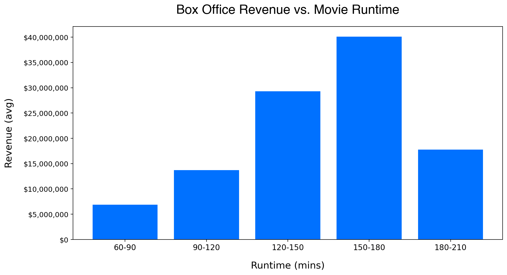
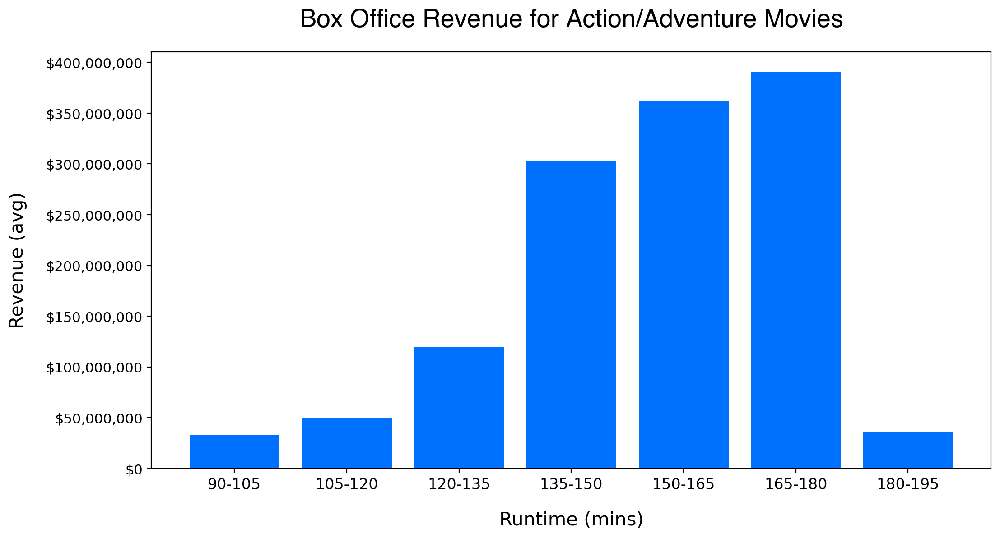
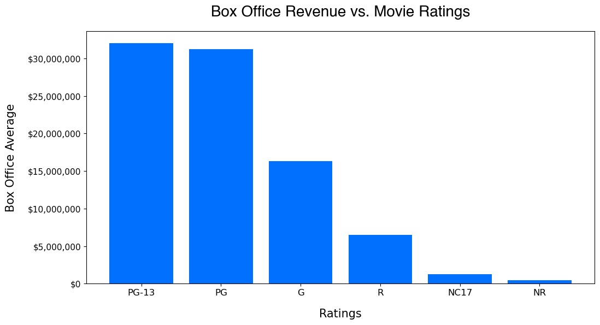

# Microsoft Studio Development Analysis

# Authors: 

Stephanie Ciaccia
 
Gideon Miles
 
Luke Sims
 

## Overview

Our hypothetical client, Microsoft Studios, has expressed its intention to establish itself as a major player in the film industry. As part of this pursuit, they have supplied us with box office film datasets to conduct exploratory data analysis and extract valuable business insights for internal stakeholders.

## Business Problem

Microsoft has observed the trend of large tech companies producing original video content and has an interest in establishing a presence by creating a new studio, despite their limited experience in the film industry. Our team is performing a comprehensive analysis of Microsoft and the film industry to determine the the key variables that Microsoft should consider while producing a profitable and successful film.

## Data

Our film data was collected through publicly available datasets including The Numbers, TMBD API, Box Office Mojo, and Sully Gnome.

The original data sets provided a variety of information on global box office films including title, genre, ratings, budget, domestic and worldwide box office earning. 

Additional data pulled to support the provided data sets includes:

[Twitch](https://sullygnome.com/games/365/watched) - top 50 most popular twitch games from 2021 - 2023
The Numbers - pulled an additional dataset that includes movie runtimes for movies from 1960-2023

## Methods

We used descriptive statistics, including measures of central tendency and variability to represent out findings. Since most of our dataset key values varied (ex: title names, movie id's, and genres were not consistent), we pulled additional datasets.

## Results

- **Content/IP** Microsoft will be purchasing roughly 25% of top viewed IP's on Twitch. A further breakdown of which of the popular IP's are worth investing.

- **Genre** -
- The highest revenue movie genres by worldwide box office are action and adventure. Action and adventure films make up 86% of global box office revenue for movies from 1995 - 2022. 
- Comedy makes up 16.63% of all movies made from 1995 - 2022, but only 14% of global box office revenue.

- **Runtime** Movies with runtimes between 120 - 180 minutes have the highest average revenue. For Action and Adventure films, runtimes between 150 - 180 minutes are the most successful and should be used as a guide for runtime length.

- **Ratings** The most succesful film's by rating fall into the PG (Parental Guidance) and PG-13 (Parents Strongly Cautioned) categories. PG and PG-13 movies are often considered more successful in terms of audience because they typically cater to a wider audience base, including both children and adults, and can be enjoyed by a broader range of viewers. 

## Conclusions:

The analysis lead to three recommendations for Microsoft Studios to consider while developing a box office film:

- **Content/IP** - Microsoft should utilize its extensive portfolio of popular video game intellectual property to create content. With the impending acquisition of Activision, Microsoft will make up approximately 28% of all viewers on Twitch, one of the top 5 major live streaming platforms, Microsoft is positioned to significantly enhance its market share in the video game space.

- **Genre** - Based on the analysis of the top-grossing film genres spanning from 1915 to 2022, it is advisable that Microsoft Studios focuses on utilizing their intellectual properties to produce Action-Adventure Films, which have historically been the most lucrative genres. This approach is likely to result in maximum profitability for the company.

- **Ratings & Runtime** - To optimize their market share and appeal to a wide audience, Microsoft should produce a film with a rating falling within the G to PG-13 range. Additionally, based on our data, 150 to 180 minutes have the highest box office earnings. 

## Next steps:

The datasets employed for our analysis were pulled from publicly available sources, and do not include cross-platform measurement data. In this regard, we recommend the utilization of Nielsen, a leading global provider of audience insight, data, and analytics, to obtain additional data and gain deeper insights into the television, film, content and digital landscape. 

To succeed, Microsoft Studio must maintain exceptional creative standards and collaborate with talented individuals capable of producing original and captivating narratives. To this end, executives spearheading the studio's efforts should allocate significant time and resources towards recruiting a robust team of production executives, thereby establishing the studio for optimal success. It is imperative to seek out exceptional talent from major studios and production companies, with a focus on top-tier producers, directors, and writers who possess in-depth industry knowledge.

Furthermore, we recommend conducting thorough research on Microsoft's intellectual property portfolio and revenue streams to evaluate the feasibility of implementing multi-platform strategies that can complement the production of film and television content.

## For more information:

See the fully analysis in the [Jupyter notebook](https://github.com/stephcia/Microsoft_Film_Project) or to review the presentation.

